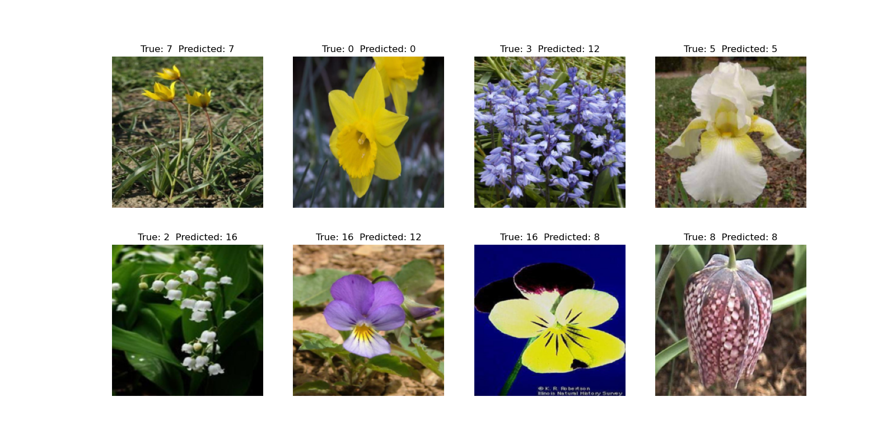

# Model Training and Inference

This repository contains code for training and inference using a deep convolutional neural network model.


## Introduction
This project aims to train and evaluate a deep learning model for a flower species classification (17 classes) task. The model is trained on a labeled dataset and later used to predict labels for new unseen flower images.

## Installation
- Clone this repository:

```bash
git clone git@github.com:yusufbrima/FlowersNet.git
```

- Install the required packages:

```bash
cd your_repository
pip install -r requirements.txt
```

## Data Preparation
- Download the dataset from [here](https://www.robots.ox.ac.uk/~vgg/data/flowers/17/index.html) and extract it a directory which should be set in the `base_dir` variables in `main.py`,`predict.py` and `Play.ipynb`  files.

### Data Samples 


## Model Training
- Train the model using the following command:

```bash
python main.py
```

## Model Inference
- Use the model to predict labels for new data using the following command:

```bash
python predict.py
```
- Alternatively, you can use the `Play.ipynb` notebook to run the model inference and visualize the results.

- The model weights are saved in the `Models` directory.

- Train, validation, and test data are saved in the `Results` directory.

# Model Performance

This table shows the performance metrics of the model on the training, validation, and test datasets.

| Dataset   | Accuracy | Loss    |
|-----------|----------|---------|
| Training  | 0.98     | 0.46    |
| Validation| 0.98     | 0.54    |
| Test      | 0.89     | 0.62    |


## Sample Prediction Outputs




## License
This project is licensed under the terms of the [MIT license]().