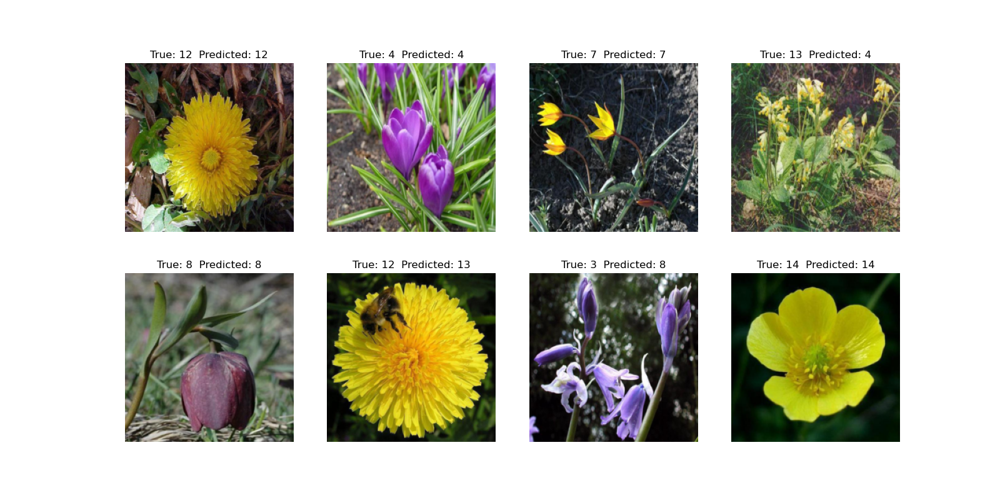

# Model Training and Inference

This repository contains code for training and inference using a deep learning model.


## Introduction
This project aims to train and deploy a deep learning model for a specific task. The model is trained on a labeled dataset and later used to predict labels for new unseen data.

## Installation
- Clone this repository:

```bash
git clone https://github.com/your_username/your_repository.git
```

- Install the required packages:

```bash
cd your_repository
pip install -r requirements.txt
```

## Data Preparation
- Download the dataset from [here](https://www.kaggle.com/c/dogs-vs-cats/data) and extract it in the `data` directory.

### Data Samples 


## Model Training
- Train the model using the following command:

```bash
python train.py
```

## Model Inference
- Use the model to predict labels for new data using the following command:

```bash
python predict.py
```

 ## Sample Output
    

## License
This project is licensed under the terms of the [MIT license]().
